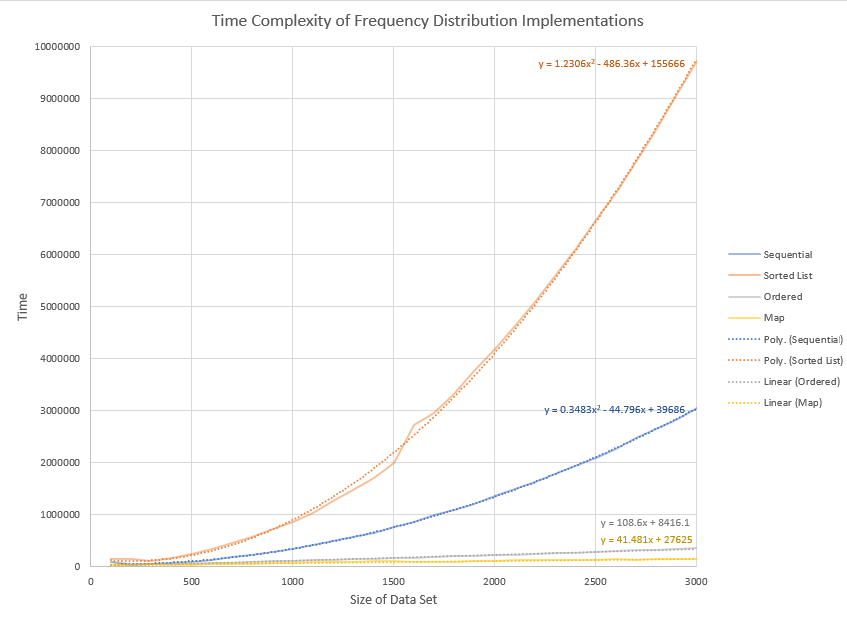

## Data Structures Project 2 - Frequency Distribution

A frequency distribution is a table that displays how many times each objectis present in 
a data set. When computing a data set there are many aproches thatwe can take, 
here whe looked at four different aproaches.

Note: When adding entries, if an entry corresponding to the object does not exist, 
we create a new entry with frecuency 1. If an entry already exists, we increase 
its frequency by 1.

**Sequential:** we iterate through the objects in the data set, and for each object we add 
to a *list* an entry corresponding to the object and its frequency. 

**Sorted List:** we iterate through the objects in the data set, and for each object we add 
to a *sorted list* an entry corresponding to the object and its frequency. 

**Ordered:** we first sort the data set, then we iterate through the objects taking advantage
of the fact that they're sorted. For each object we add to a *list* an entry corresponding to 
the object and its frequency.

**Map:** we iterate through the objects in the data set, and for each object we add to 
a *map* an entry corresponding to the object and its frequency, tanking advantage of the
map's O(n) key look  up. 

Testing eaches strategies time complexity, we find that the Sequential and Sorted List strategies
are O(n^2), while the Ordered and Map strategies are O(n).

 
